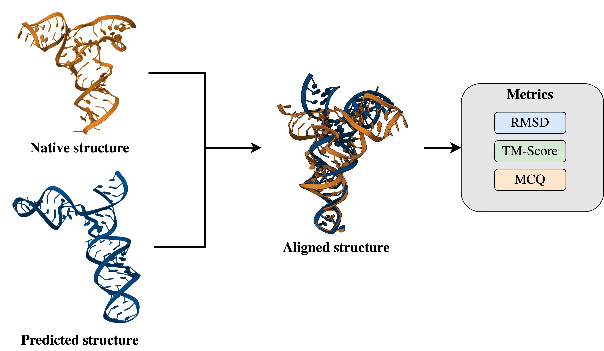
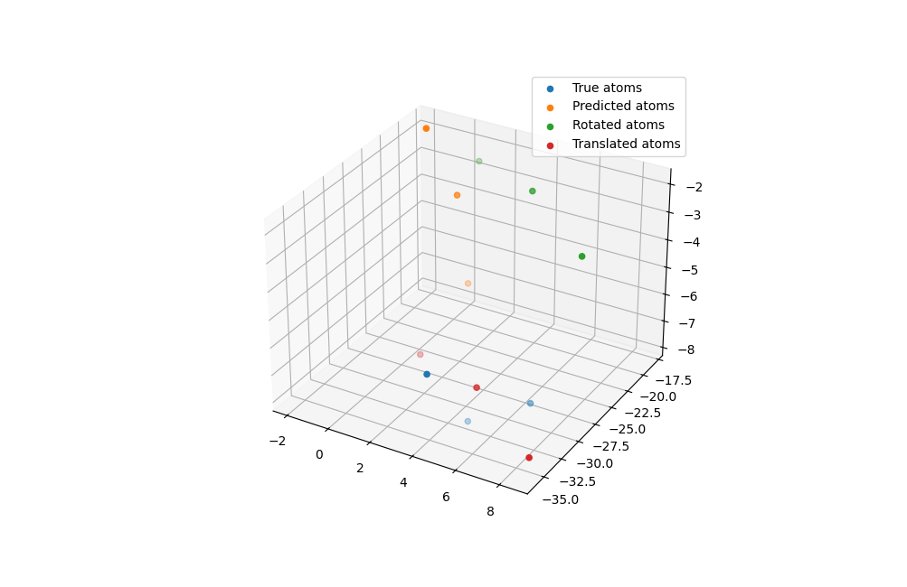

# Coarse-grained RMSD vs common metrics



## Folder explanation

In the `data` folder, you can find the following folders:
- **NATIVE**: native `.pdb` structures from a community challenge RNA-Puzzles (@rna_puzzles) (22 non-redundant RNAs)
- **PREDS**: predicted `.pdb` structures from different models.
- **SCORES**: metrics computed between the native structures and the predicted ones. It comprises the `RMSD`, `MCQ` and `TM-Score`

In the `src` folder, you have a `utils.py` method that shows you how to superimpose a set of points using:

```
python -m src.utils
```

It should output the following image:



Feel free to use the functions in the file and include it in your code. 

## Installation

You might need `numpy`, `scipy`, `matplotlib` and `biopython` to run this project: 
```bash
pip install numpy scipy matplotlib biopython
```
